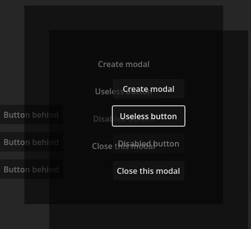

# Godot keyboard UI collection

[Go to the technical documentation here](https://josvanegmond.github.io/godot-keyboard-ui/)

This repository contains the entire collection of godot UI components that assist the use of keyboard (and other non-mouse input devices).
I started this collection to support accessibility for games on various aspects.
Games should not have to reinvent the wheel every time to implement these accessibility features.

This addon will work for Godot version 4.5 and up.

## Scope

I intend this collection to address issues and provide utilities from the following topics:

- Focus control: from tab-traps to wrapping, have components manage better control of the focus than natively is given.
- Input: from keyboard to controller support, focus control with arrow-keys and d-pad, remapping triangles, Y-buttons, and keys.
- Audio on UI: if you want your button to play a sound, you'd need to start from scratch. This addon provides the utilities to hook on many events that tells you when to play which sound as the user navigates through the UI.
- Screen readers and TTS: utilities that take away the boilerplate of controlling what and when screen readers or TTS speak out text. Separating UI from story content.

## How to use

As of right now, copy the addons folder to the main root of your project (where other addons live).
Once in your project, enable the addon in project > Project settings > Plugins.

In the future I might make a separate github project that you can directly add to your game folder as a submodule.
A readme is provided for every feature in this collection, and examples can be found in the example folder.

## Available components

These components can be dragged or created in your project:

- [FocusControl](https://josvanegmond.github.io/godot-keyboard-ui/focus-control/): A helper node that makes arrow keys behave the same as tabbing for consistency purposes
- [Modal](https://josvanegmond.github.io/godot-keyboard-ui/modal/): A screen covering node that traps the focus within its children
- [Dialog](addons/keyboard_ui/dialog/readme.md): A convenience node that lets you set up pages of text to click through in a screen reader friendly way
- [UIAudio](https://josvanegmond.github.io/godot-keyboard-ui/ui-audio/): A global utility class that you can use to manage all UI audio in a central place

## Suggestions?

Feel free to create an issue if you have a suggestion, find a bug, or think there is a better way to do something!

## Credits

All sounds generated with https://sfxr.me/.
All code by me.

## Gallery

### Dialog example

### Modal example

